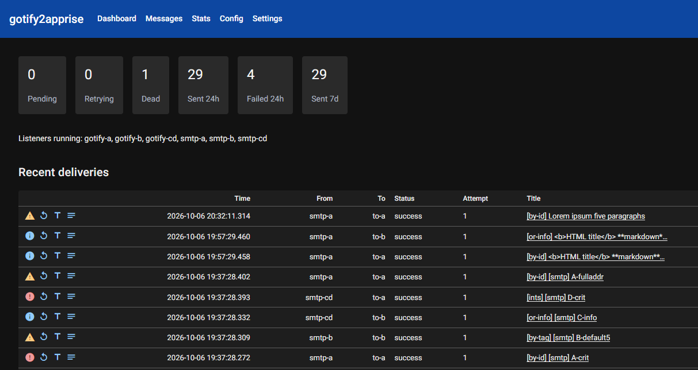

# gotify2apprise

[](https://hub.docker.com/r/mfandreich/gotify2apprise) [](https://github.com/mfandreich/gotify2apprise/pkgs/container/gotify2apprise)

English | [Русский](readme.ru.md)

Homelab notification bridge: **listeners** (Gotify, optional SMTP) → YAML **routes** → **receivers** (Apprise), with SQLite history, retries, and a small web UI.

Hobby project, built together with [Cursor](https://cursor.com).



Put the UI behind a reverse proxy. App login is a single local user, not production-grade auth.

## Requirements

- Python 3.12+ or Docker
- YAML config (`version: 2`)
- For Gotify: a **client** token (not an app token)

## Environment

| Variable | Default | Description |
|---|---|---|
| `CONF_FILE` | `/etc/gotify2apprise/config.yaml` | Path to YAML v2 |
| `DATA_DIR` | `/var/lib/gotify2apprise` | SQLite + session secret file |
| `UI_HOST` / `UI_PORT` | `0.0.0.0` / `8080` | Web UI bind |
| `STORAGE_SECRET` | generated into `DATA_DIR/.storage_secret` | NiceGUI session signing |
| `ADMIN_USER` / `ADMIN_PASSWORD` | `admin` / random (logged once) | Bootstrap the single UI user if the DB is empty |
| `AUTO_MIGRATE_V1` | `false` | If `true`, convert a v1 YAML in place (writes `.bak.v1`) |
| `GOTIFY_HOST` / `GOTIFY_TOKEN` | — | Optional; used as `${GOTIFY_HOST}` / `${GOTIFY_TOKEN}` in YAML |
| `TITLE_TEMPLATE` / `MESSAGE_TEMPLATE` | — | Deprecated; prefer `defaults` in YAML |
| `MESSAGE_RETENTION_DAYS` | `30` | Drop old messages |
| `MAX_MESSAGES_PER_CHANNEL` | `500` | Cap per listener |

`GOTIFY_HOST` is host[:port] **without** scheme. Set `ssl: true` on the Gotify listener for `https`/`wss`.

## Configuration (YAML v2)

See [config.example.yaml](config.example.yaml). Three lists: `listeners`, `receivers`, `routes`. Tags on entities are labels. On a route, `listeners` / `listener_tags` (and the `to` equivalents) are **OR**: union of explicit ids and any enabled entity sharing at least one tag.

```yaml
version: 2
listeners:
  - id: gotify-main
    type: gotify
    tags: [alerts]
    options:
      host: "${GOTIFY_HOST}"
      client_token: "${GOTIFY_TOKEN}"
      ssl: false
      app_tokens: [all]    # or concrete Gotify app tokens
receivers:
  - id: telegram-alerts
    type: apprise
    tags: [alerts]
    options:
      urls:
        - tgram://BOT_TOKEN/CHAT_ID
routes:
  - id: gotify-to-telegram
    from:
      listeners: [gotify-main]
    to:
      receivers: [telegram-alerts]
    filter:
      min_priority: warn   # int or info|warn|crit
    templates:
      title: "[$priorityStr] $title"
      body: "$message"
    delivery:
      max_attempts: 5  # 0 = retry forever; exponential then requires max_delay_sec
      initial_delay_sec: 30
      backoff: exponential   # or fixed
      max_delay_sec: 3600
```

Priority buckets: **info** 0–3, **warn** 4–7, **crit** 8–10. An integer in `priorities` means that exact value.

Template placeholders: `$title` `$message` `$appid` `$priority` `$priorityStr`.

`defaults.datetime_format` controls timestamps in the web UI (UTC). Default is `%Y-%m-%d %H:%M:%S.%f`. Here `%f` is **milliseconds, three digits** (not Python microseconds). Omit the key to keep the default.

`max_attempts: 0` retries forever. Exponential backoff then **requires** `max_delay_sec` (otherwise delays would grow without a cap). `fixed` backoff does not.

`${ENV}` and `${ENV:-default}` are expanded at load time.

Forwarding back into Gotify (`gotify://…` Apprise URL) can loop — don't.

### SMTP listener

For internal networks only (no auth, no TLS in v1 of this feature). Several `smtp` listeners may **share one host:port**; they split on `mailboxes` vs `RCPT TO`:

- `alerts` — local-part only, any domain (`alerts@anything`)
- `alerts@bridge.local` — exact address (case-insensitive). Wins over a local-part rule on the same recipient.

Suffixes `.low` `.info` `.normal` `.warn` `.high` `.crit` override priority (`alerts.high@bridge.local` still matches `alerts` or `alerts@bridge.local`).

If more than one SMTP listener binds the same port, each **must** set `mailboxes`, and those names must not overlap. A single listener with empty `mailboxes` still accepts everything on that port.

```yaml
- id: smtp-alerts
  type: smtp
  tags: [mail]
  options:
    host: 0.0.0.0
    port: 2525
    mailboxes: [alerts]
    default_priority: 5
- id: smtp-uptime
  type: smtp
  tags: [mail]
  options:
    host: 0.0.0.0
    port: 2525
    mailboxes: [uptime@bridge.local]
    default_priority: 5
```

Subject → title, body → message. `X-Priority` 1–5 maps to Gotify-style 10…0. Publish the port only on a trusted Docker network. The Config UI can insert this snippet.

## Migrating from v1

v1 `applications[]` is **not** read at runtime.

```bash
python -m gotify2apprise.legacy.migrate_v1 --in-place /path/to/config.yaml
# or
python scripts/migrate_config_v1_to_v2.py config.yaml -o config.v2.yaml
```

Or set `AUTO_MIGRATE_V1=true`: backup `config.yaml.bak.v1`, write v2, continue boot. Integer entries in old `priorities` now match that number (the v1 int bug is **not** preserved).

## Docker Compose

Image: [`mfandreich/gotify2apprise`](https://hub.docker.com/r/mfandreich/gotify2apprise) or [`ghcr.io/mfandreich/gotify2apprise`](https://github.com/mfandreich/gotify2apprise/pkgs/container/gotify2apprise). Copy [config.example.yaml](config.example.yaml) to `config.yaml`, then:

```bash
docker compose up -d
# or build locally:
docker compose up -d --build
```

UI: `http://localhost:8080`. Change the admin password under Settings.

## Run locally

```bash
pip install -r requirements.txt
export DATA_DIR=./data CONF_FILE=./config.yaml
export ADMIN_USER=admin ADMIN_PASSWORD=changeme
export GOTIFY_HOST=localhost:80 GOTIFY_TOKEN=your_client_token
python -m gotify2apprise.main
```

Tests: `pip install -r requirements-dev.txt && pytest`.

## License

MIT — see [license](license).
